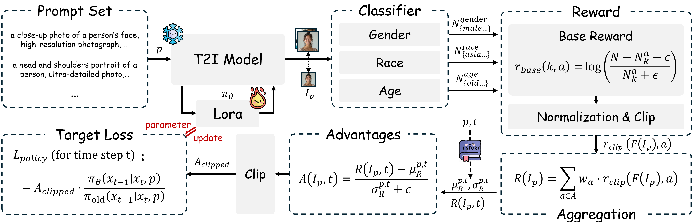

<div align="center">
    
# HoloFair: Unified T2I Fairness Evaluation and Fair-GRPO Debiasing

[](https://icml.cc/virtual/2026/poster/62706)
[](https://arxiv.org/abs/2605.24687)
[](https://huggingface.co/)
[](LICENSE)
</div>

**A comprehensive benchmark and RL-based debiasing framework for demographic fairness in Text-to-Image models.**

This repository contains the official implementation for **HoloFair**. We introduce an end-to-end framework that evaluates deep-semantic fairness in T2I models and mitigates biases via reinforcement learning, without degrading image quality.

---

## 🔥 News

- **[2026.5.1]** 🎉 Paper accepted at **ICML 2026**!
- **[2026.6]** Code, models, and datasets will be released. Coming soon.


---

## 💡 Core Idea: Beyond Surface-Level Audits

Existing fairness evaluations only test default distributions (e.g., *"a photo of a person"*), missing the deeper biases that emerge under semantically loaded contexts. For instance, SDXL achieves the highest default diversity but collapses severely when prompted with *"a professional person"*. **HoloFair** exposes these hidden biases.

<div align="center">

</div>

**Figure 1.** Overview of the HoloFair framework. Our end-to-end pipeline consists of three stages: Dataset Construction, Classifier Training, and Fairness Evaluation.

---

## 🔎 The Three Components

### 📊 MGBI Metric

The **Multi-attribute, Group-wise Bias Index** jointly measures two complementary aspects of fairness:

- **Intrinsic Diversity (ID)**: Geometric mean of normalized entropies across gender, age, and race on neutral prompts. Penalizes models that are diverse on one attribute but collapsed on another.
- **Context-Robust Diversity (CA<sub>q</sub>)**: 10th percentile of per-trigger diversity scores under bias-inducing semantic contexts (grounded in the Stereotype Content Model). Captures near-worst-case behavior.
- **MGBI = √(ID × CA<sub>q</sub>)**: A single unified score. The geometric mean ensures a model cannot compensate low ID with high CA<sub>q</sub> or vice versa.

### 🔍 HoloFair Benchmark

An end-to-end evaluation framework built on:
- **Prompt Sets**: 300 neutral + 450 semantic trigger prompts (Eval), 10,000 prompts (Train), 300 biased prompts (Gen)
- **RBD Dataset**: 119K images from FairFace, UTKFace, in-the-wild portraits, and AI-generated images
- **SpaFreq Classifier**: Dual-stream DINOv2 architecture combining spatial semantics and wavelet frequency features


<div align="center">

</div>

**Figure 2.** Overview of the RBD dataset.


### ⚡ Fair-GRPO Debiasing

A reinforcement-learning method using a **multi-attribute per-prompt reward function**:
- Log-ratio base reward penalizes over-represented categories and rewards under-represented ones
- Zero-centered, clipped, and aggregated across gender, age, and race
- KL-regularized policy optimization prevents quality degradation


<div align="center">

</div>

**Figure 3.** Overview of the Fair-GRPO Debiasing method.


---
## 📋 Main Results

### Fairness Benchmark (8 T2I Models)

| Type | Model | ID ↑ | CA₀.₁ ↑ | CA_mean ↑ | MGBI ↑ |
|:-----|:------|:----:|:-------:|:---------:|:------:|
| Gen-only | SDXL | 0.8186 | 0.2865 | 0.4313 | 0.4843 |
| Gen-only | SD3.5-Large | 0.7480 | 0.3693 | 0.5456 | 0.5255 |
| Gen-only | Flux1-dev | 0.6858 | 0.6702 | 0.6945 | 0.6780 |
| Gen-only | SANA-1.5 | 0.7820 | 0.3821 | 0.5794 | 0.5466 |
| Unified | Show-o | 0.7005 | 0.6013 | 0.6646 | 0.6490 |
| Unified | Harmon | 0.5320 | 0.4661 | 0.5042 | 0.4979 |
| Unified | Bagel | 0.6152 | 0.5004 | 0.5830 | 0.5549 |
| Unified | Blip3-o | 0.4030 | 0.1856 | 0.3370 | 0.2735 |

> **Key finding:** SDXL achieves the highest ID (0.82) but near-lowest CA₀.₁ (0.29). High default diversity ≠ conditional robustness. Evaluations limited to default distributions would erroneously rank SDXL as the fairest model.

---


## 📁 Repository Structure

```
HoloFair/
├── benchmark/                     # HoloFair Evaluation
│   ├── evaluate.py                # MGBI evaluation script
│   ├── metrics/mgbi.py            # ID, CAq, MGBI implementation
│   └── prompts/                   # Eval & Train prompt sets
│
├── classifiers/                   # SpaFreq Classifiers
│   ├── train_classifier.py        # Training script
│   └── models/spafreq.py         # DINOv2 dual-stream architecture
│
├── fair_grpo/                     # Fair-GRPO Debiasing
│   ├── train_sd3.py               # SD3.5M training
│   ├── reward/                    # Multi-attribute reward function
│   ├── diffusers_patch/           # Pipeline & SDE with log-prob
│   └── configs/                   # Training configurations
│
└── dataset/                          # Dataset utilities
```

---

## 🧩 Extensibility

HoloFair is designed as an open framework:

- **New attributes**: The MGBI metric operates on any categorical distribution. Adding new demographic dimensions requires only training a new classifier head.
- **New models**: The evaluation pipeline accepts any T2I model. No architectural assumptions.
- **Non-uniform targets**: The reward function generalizes to arbitrary target distributions by specifying desired proportions. No code changes needed.
- **New semantic triggers**: Additional bias-inducing contexts can be added without modifying the evaluation framework.

---

## 📖 Citing Our Work

If you find HoloFair useful in your research, please consider citing:

```bibtex
@inproceedings{chen2026holofair,
  title     = {HoloFair: Unified T2I Fairness Evaluation and Fair-GRPO Debiasing},
  author    = {Ruyi Chen and Lu Zhou and Xiaogang Xu and Chiyu Zhang and Jiafei Wu and Liming Fang},
  booktitle = {International Conference on Machine Learning (ICML)},
  year      = {2026},
  url       = {https://arxiv.org/abs/2605.24687}
}
```

---

## ⚠️ Ethics Statement

All classifiers and metrics operate at the distributional level for group-level assessment, not individual profiling. We acknowledge that discrete demographic taxonomies are inherently reductive and that demographic classifiers carry misuse risks. All artifacts are released under licensing terms that restrict usage to research purposes, and annotated datasets comply with relevant privacy and data-protection regulations.

---

## 🙏 Acknowledgements

This work was supported by the National Natural Science Foundation of China (62132008, U22B2030, 62472218) and the Natural Science Foundation of Jiangsu Province (BK20220075).

---

**License**: [Apache 2.0](LICENSE). All classifier models and annotated datasets are restricted to **research purposes only**.
